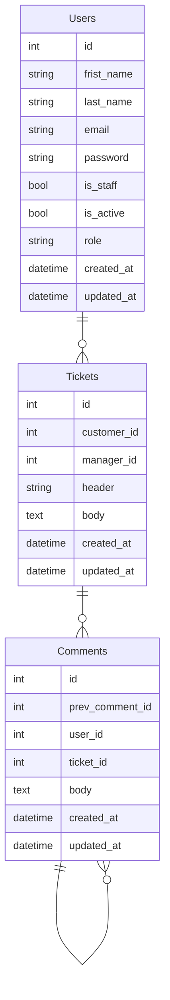

# Support App

<a href="https://www.python.org/downloads/release/python-3100/">
    </a>
<a href="https://www.djangoproject.com/">
    </a>
<a img src="https://img.shields.io/badge/django-4.1.0-blue/">
</a>


</br>

<p align="left"><span style="font-style: italic; font-weight: bold">Support app</span> is an application created to help in communication with customers to solve issues. It`s suitable for projects were communication app between users is needed like web services, marketplaces, online shops, etc... </p>
</br>

---
## 🔌 Application is powered by

**Core tools**

- ✔️ [Python 3.10](https://www.python.org/downloads/release/python-3100/)
- ✔️ [Django 4.1](https://www.djangoproject.com/)

**Code quality tools**

- ✔️ [black](https://github.com/psf/black)
- ✔️ [flake8](https://github.com/pycqa/flake8)
- ✔️ [isort](https://github.com/PyCQA/isort)
- ✔️ [mypy](https://github.com/python/mypy)

**Additional tools**
- ✔️ [Docker](https://www.docker.com)
- ✔️ [Gunicorn](https://gunicorn.org/)
- ✔️ [NGINX](https://nginx.org/ru/)
- ✔️ [Celery](https://docs.celeryq.dev/en/stable/)
- ✔️ [Redis](https://redis.io/)


---
</br>

## ⚠️ Mandatory steps

### 1. Clone the project from GITHub🌐

```bash
git clone https://github.com/mmedchuk/support_app
```

### 2. Setup and config environment

- Make sure if you have installed Python 3.10 interpreter.
- Install Pipenv Enviroment and initialize it.

```bash
#Install Pipenv
pip install pipenv

#Initialization of virtual enviroment
pipenv shell
```

- Install depencities from Lock file.

```bash
pipenv sync
```

- Make sure all depencities are installed.
- Install pre-commit hooks for code quality control before commit

```bash
pre-commit install
```
---
<br>

## 🏃 Quickstart
We tried to make getting started with our app quick and painless. To start quick use we implement Docker technology which takes care of most of the installation process for this API. 
To start installation run the following steps:
<ol>
<li>Make sure you have installed Python
<li>Install an appopriate Docker version
<li> Run Docker-compose command to start installation

```bash
# Build images
docker-compose build

# Build image from scratch without cache
docker-compose build --no-cache
```
<li> Wait a few time when Docker when install ang configure all tools
<li> After installation you can use our API

</ol>

</br>

### ➕  Some usefull Docker-compose commands


```bash
# Run container
docker-compose up -d

# Build images
docker-compose build

# Stop containers
docker-compose down

# Restart containers
docker-compose restart

# Check containers status
docker-compose ps

## Logs

# get all logs
docker-compose logs

# get specific logs
docker-compose logs app

# get limited logs
docker-compose logs --tail 10 app

# get flowed logs
docker-compose logs -f app
```

</br>

## ➕ Additional information

### Usefull commands:

```bash
# Run project with Gunicorn server
gunicorn src.config.wsgi:application --localhost:8000

# Run project with Gunicorn server configused in the separate conf.file
gunicorn src.config.wsgi:application -c gunicorn.conf.py

```
---
</br>

## 🧩 Application description:

```
▾ users
    ├─ apps.py # Django apps configuration
    ├─ urls.py # pre-controller
    ├─ views.py # Endopints / post-controller
    ├─ models.py # Database tables mapper
    ├─ admin.py # Database tables mapper
    └─ views.py # Endopints / post-controller
```

---
</br>


## 🛢 Database Schema:


---
</br>
</br>

# Application architecture:


---
</br>

# ♾️ Deployment

## Abbreviations:

- CS - Cloud Service
- WinOS - Windows
- VM - Virtual Machine


</br>

## Workflow:

1. Check if your local project works correctly.
2. Choose your cloud service 
3. Create a VM (for example, Digital Ocean gives a name as Droplet).
4. Select operation system and make initial hardware settings.
5. Choose an authentication method. Most popular are SSH(recommended) and HTTPS. 
    
    **Note:** If you select WinOS, you need to install GIT and Putty (terminal emulator and SSH client) on your local machine.
    
6. If you choose SSH (recommended) - create public and private key. If you use WinOS - use GIT GUI to create private and public key for your CS.  For Unix you can use the next bash command:
    
    ```bash
    ssh-keygen -t rsa -b 4096 -f ~/.ssh/mykey
    ```
    
7. Ensure than VW was created. If creating process was finished, your CS gives you public (IP for external connections) and private IP(IP for internal connections inside the selected CS. So you can connect your VM`s inside CS network).
8. Connect to your VM via SSH. Run the code:
    
    ```bash
    ssh <Public IP> -i <Private ssh file> -l <Defaut User>
    
    #Alternative command
    ssh <Defaut User>@<Public IP> -i <Private ssh file>
    ```
    
    To simplify ssh connection you can use ssh config file. It looks like .yml file but technically it is run like .py file.  In more detail you can find our in
    
    [SSH config file syntax and how-tos for configuring the OpenSSH client](https://www.ssh.com/academy/ssh/config)
    
    Config:
    
    ```bash
    #===============
    # [Support App]
    #===============
    Host Support_app
    	HostName <ip_address>
    	Port <port>
    	User <user>
    	IdentityFile ~/.ssh/id_rsa
    	
    ```
    
9. Install Docker:
    
    ```bash
    # Uninstall old versions of Docker
    sudo apt-get remove docker docker-engine docker.io containerd runc
    
    # Update the apt package index and install packages to allow 
    # apt to use a repository over HTTPS
    
    sudo apt-get update
    sudo apt-get install \
        ca-certificates \
        curl \
        gnupg \
        lsb-release
    
    # Add Docker’s official GPG key
    sudo mkdir -m 0755 -p /etc/apt/keyrings
    curl -fsSL https://download.docker.com/linux/ubuntu/gpg | sudo gpg --dearmor -o /etc/apt/keyrings/docker.gpg
    
    # Use the following command to set up the repository
    echo \
      "deb [arch=$(dpkg --print-architecture) signed-by=/etc/apt/keyrings/docker.gpg] https://download.docker.com/linux/ubuntu \
      $(lsb_release -cs) stable" | sudo tee /etc/apt/sources.list.d/docker.list > /dev/null
    
    # Update the apt package index
    sudo apt-get update
    
    # Install Docker Engine, containerd, and Docker Compose.
    sudo apt-get install docker-ce docker-ce-cli containerd.io docker-buildx-plugin docker-compose-plugin
    
    # Install Docker-compose
    apt install docker-compose
    
    # Check Docker status
    sudo systemctl status docker
    ```
    
    You can also install via alternative package manager Snap:
    
    [Install docker on Ubuntu using the Snap Store | Snapcraft](https://snapcraft.io/install/docker/ubuntu)
    
10. Clone project from GitHub:
    
    ```bash
    # Install SSH keys
    ssh-keygen -t rsa -b 4096 -C "support_app"
    
    # Add SSH public key to GIT hub account
    
    # Copy project from GitHub reprository
    git clone git@github.com:mmedchuk/support_app.git
    ```
    
11. Create .env from .env.default:
    
    ```bash
    cp env.default .env
    ```
    
12. Configure env variables in .env via Nano or Vim. Remove port binding in Postgres (is recommended for higher security of the project).
13. Build project running command:
    
    ```bash
    docker-compose build
    ```
    
14. Check IP connection in eth0 using ifconfig from nettools package:
    
    ```bash
    apt install nettools
    ```
    

15. Try to connect via browser. Insert your public IP and port to the adress field and press enter. Done

---
</br>

## ⌛ Release History

*1.0.0 Work in progress*

- First release

### To be continued…
