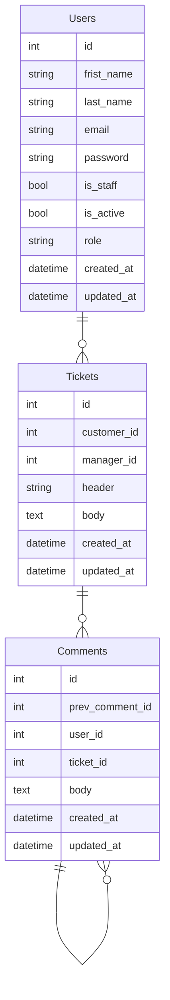

# README

# Support App


[https://img.shields.io/badge/django-4.1.0-blue](https://img.shields.io/badge/django-4.1.0-blue)


***Support app*** is an application created to help in communication with customers to solve issues. It`s suitable for projects were communication app between users is needed like web services, marketplaces, online shops, etc…

## :gear: Application is powered by

**Core tools**

- ✔️ [Python 3.10](https://www.python.org/downloads/release/python-3100/)
- ✔️ [Django 4.1](https://www.djangoproject.com/)

**Code quality tools**

- ✔️ [black](https://github.com/psf/black)
- ✔️ [flake8](https://github.com/pycqa/flake8)
- ✔️ [isort](https://github.com/PyCQA/isort)

## ⚠️ Mandatory steps

### 1. Clone the project from GITHub🌐

```bash
git clone https://github.com/mmedchuk/support_app
```

### 2. Setup and config environment

- Make sure if you have installed Python 3.10 interpreter.
- Install Pipenv Enviroment and initialize it.

```bash
#Install Pipenvpip install pipenv#Initializationpipenv shell
```

- Install depencities from Lock file.

```bash
pipenv sync
```

- Make sure all depencities are installed.
- Install pre-commit hooks for code quality control before commit

```bash
pre-commit install
```

## 🏃 Start working with application

To start wirking with thes project you can use Docker-compose

```bash
docker-compose up -d
```

Other usefull commands:

```bash
# Build images
docker-compose build

# Stop containers
docker-compose down

# Restart containers
docker-compose restart

# Check containers status
docker-compose ps

## Logs

# get all logs
docker-compose logs

# get specific logs
docker-compose logs app

# get limited logs
docker-compose logs --tail 10 app

# get flowed logs
docker-compose logs -f app
```

**Application description:**

```
▾ users
    ├─ apps.py # Django apps configuration
    ├─ urls.py # pre-controller
    ├─ views.py # Endopints / post-controller
    ├─ models.py # Database tables mapper
    ├─ admin.py # Database tables mapper
    └─ views.py # Endopints / post-controller
```

**Database:**



## ⌛ Release History

*1.0.0 Work in progress*

- Initial app version

### To be continued…